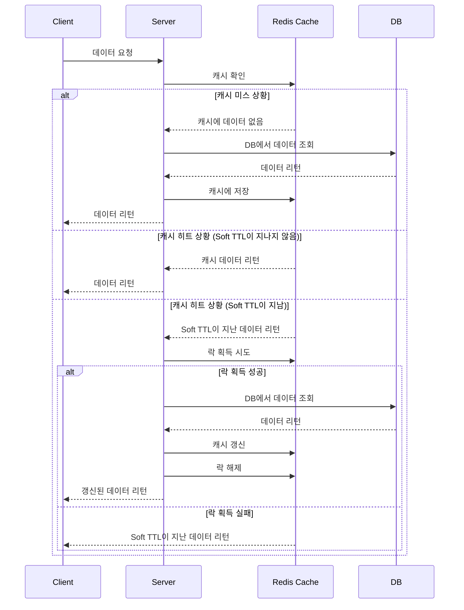

# two-level-ttl-cache

# 들어가며.

캐시 만료 시점에 모든 요청이 DB를 찌르게되어 부하가 발생하는 문제인 Cache Stampede는 개발을 할 때 주의해야하는 사항 중 하나이다.

관련 내용은 아래 글에 잘 나와있다.

[캐시 문제 해결 가이드 - DB 과부하 방지 실전 팁](https://toss.tech/article/25301)

Cache Stampede를 해결하는 방식 중 분산락을 사용하는 방식이 있고, 그 중 가장 쉽게 생각할 수 있는 방식은 다음과 같다.

- 캐시가 만료되면 캐시 갱신에 대한 Lock을 획득한 요청이 캐시를 갱신하고 다른 요청들은 대기하는 구조로 만든다.
- Lock을 획득한 요청이 캐시를 갱신하면 다른 요청들이 캐시를 읽는다.
- 하지만 이렇게 만들게 되면 Lock을 획득한 요청이 캐시를 갱신시킬 때까지 다른 요청들은 대기하는 비용이 생긴다.

이러한 비용을 줄이기 위해 데이터 갱신을 실제 캐시 만료 시간보다 이전에 해서 Lock을 획득하지 못한 요청들은 아직 만료되지 않은 캐시에서 데이터를 들고가도록 하게끔 만들면 된다.

즉, 갱신을 위한 만료 시간(Soft TTL)과 실제 캐시 만료 시간(Hard TTL)을 구분하여 갱신을 수행하는 동안에도 캐시는 만료되지 않은 상태로 둔다. 이렇게 되면 Lock을 획득하지 못한 요청이 대기하지 않고 캐시에서 값을 읽어갈 수 있게 된다.

# 플로우



# 구현

```kotlin
@Service
class MemberService(
    private val memberRepository: MemberRepository
) {
    @TwoLevelTtlCacheable(
        cacheName = "member",
        key = "#name",
        softTtlSeconds = 3,
        hardTtlSeconds = 5,
    )
    fun findByName(name: String): Member? {
        return memberRepository.findByName(name)
    }
}
```

위와 같이 사용할 수 있도록 AOP를 작성해주자.

대략적인 코드는 아래와 같다.

```kotlin
@Aspect
@Component
class TwoLevelTtlAspect(
    private val redisCacheService: RedisCacheService
) {
    @Around("@annotation(TwoLevelTtlCacheable)")
    fun around(pjp: ProceedingJoinPoint): Any? {
        val cachedData = redisCacheService.getCachedData(redisKey)

        // 1. 캐시 미스
        if (cachedData == null) {
            return fillCacheAndReturn(...)
        }

        // 2. Soft TTL 체크
        if (now > cachedData.softTtl) {
            val tryLock = redisCacheService.tryLock(lockKey, 3)
            return if (tryLock) {
                // 3. 락 획득 성공 - 캐시 갱신
                fillCacheAndReturn(...)
            } else {
                // 4. 락 획득 실패 - 기존 데이터 반환
                objectMapper.readValue(cachedData.data, returnType)
            }
        }

        // 5. 캐시 히트
        return objectMapper.readValue(cachedData.data, returnType)
    }
}
```
