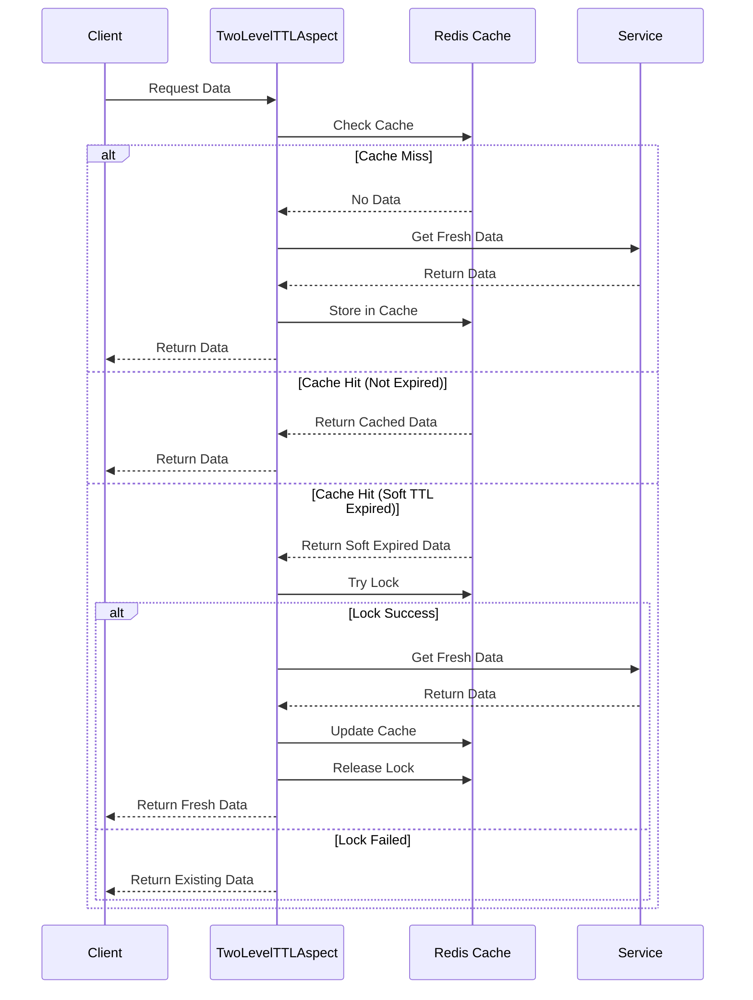

# two-level-ttl-cache

캐시 만료 시점에는 Cache Stampede라는 문제가 발생할 수 있어 유의해야한다. 

이 해결책으로 아래 글에 소개된 것처럼 분산락을 사용하는 방식이 있다.

[캐시 문제 해결 가이드 - DB 과부하 방지 실전 팁](https://toss.tech/article/25301)

하지만 분산락을 사용하여 한 요청만 캐시 갱신에 대한 Lock을 획득하고 다른 요청들은 대기해야하는 구조로 만들면 Lock을 획득한 요청이 캐시를 갱신시킬때까지 대기하는 비용이 든다.

이러한 비용을 줄이기 위해 데이터 갱신을 실제 캐시 만료 시간보다 이전에 해서 Lock을 획득하지 못한 요청들은 캐시에서 데이터를 들고가도록 하게끔 만들 수 있다.

즉, 갱신을 위한 만료 시간(Soft TTL)과 실제 캐시 만료 시간(Hard TTL)을 구분하여 갱신을 수행하는 동안에도 캐시는 만료되지 않은 상태로 둔다. 이렇게 되면 Lock을 획득하지 못한 요청이 대기하지 않고 캐시에서 값을 읽어갈 수 있게 된다.



```kotlin
@Aspect
@Component
class TwoLevelTtlAspect(
    private val redisCacheService: RedisCacheService
) {
    @Around("@annotation(TwoLevelTtlCacheable)")
    fun around(pjp: ProceedingJoinPoint): Any? {
        val cachedData = redisCacheService.getCachedData(redisKey)

        // 1. 캐시 미스
        if (cachedData == null) {
            return fillCacheAndReturn(...)
        }

        // 2. Soft TTL 체크
        if (now > cachedData.softTtl) {
            val tryLock = redisCacheService.tryLock(lockKey, 3)
            return if (tryLock) {
                // 3. 락 획득 성공 - 캐시 갱신
                fillCacheAndReturn(...)
            } else {
                // 4. 락 획득 실패 - 기존 데이터 반환
                objectMapper.readValue(cachedData.data, returnType)
            }
        }

        // 5. 캐시 히트
        return objectMapper.readValue(cachedData.data, returnType)
    }
}
```
